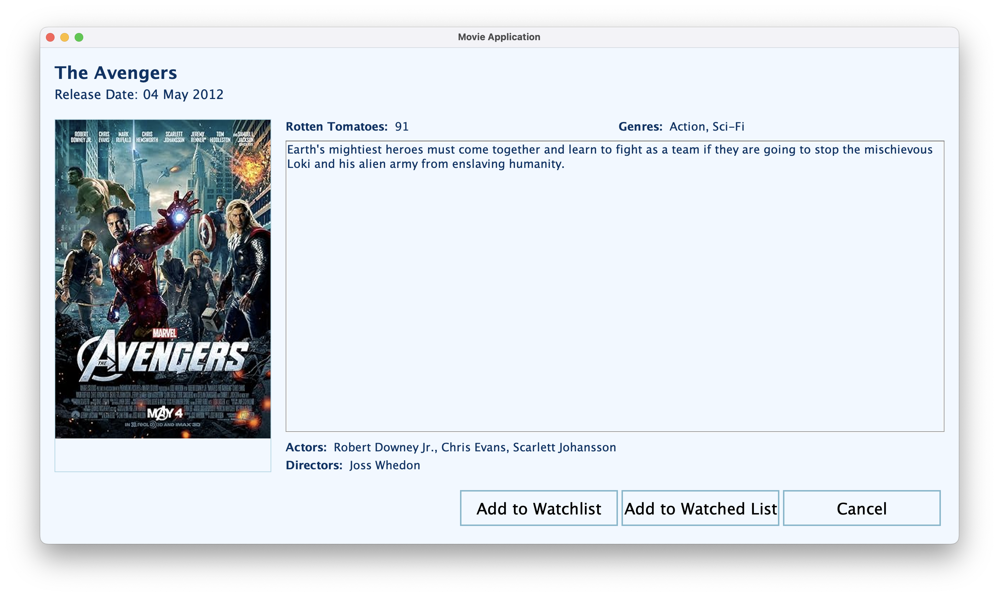
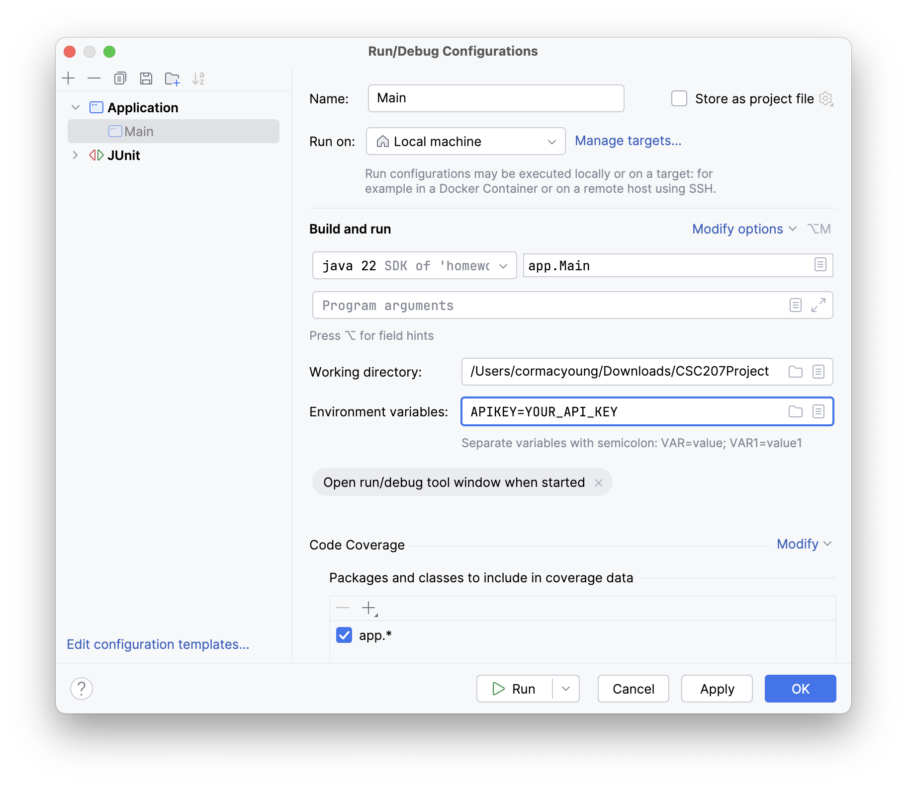
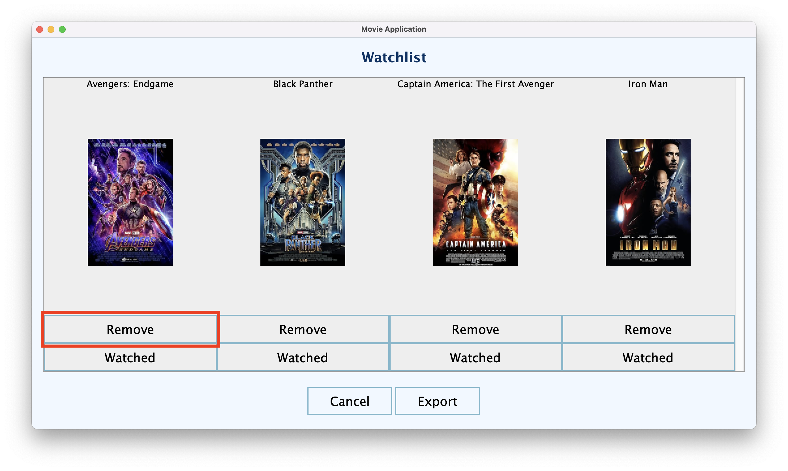
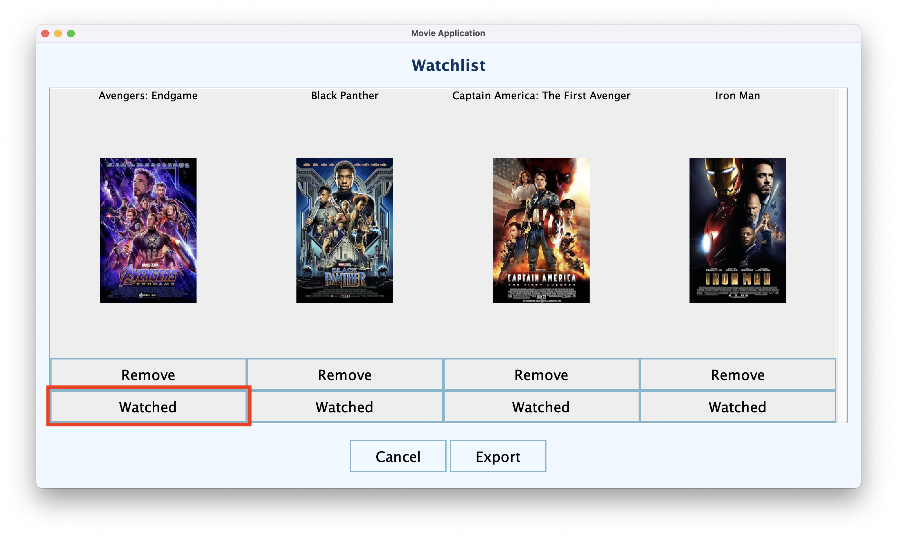

# CSC207Project: Movie Application

### Authors and Contributors
- Aseer Baset 
- Cormac Young 
- Humza Chaudhry 
- Samir Hendawi 
- Serdar Zhangali

### Project Purpose
The purpose of this project is to create a movie organization system that allows users to explore and manage a comprehensive database of movies. Users can search for movies by title, view details including the rating, release date, and genre, create and manage watchlists, rate movies, and maintain a history of watched films.

### Table of contents

<!-- TOC -->
* [Authors and Contributors](#authors-and-contributors)
* [Project Purpose](#project-purpose)
* [Features of the software](#features-of-the-software)
* [Installation instructions](#installation-instructions)
* [Usage guide](#usage-guide)
* [License](#license)
* [Feedback](#feedback)
* [Contributions](#contributions)
* [User Stories](#user-stories)
<!-- TOC -->

### Features of the software
- Signup, login, and change password.
- Search for movies and view detailed information, including title, release date, Rotten Tomatoes score, genres, actors, directors, and a description.
- Add and remove movies from a watchlist to keep track of films you want to watch.
- Add and remove movies from a watched list to track films you’ve already seen.
- Rate movies you’ve watched on a scale of 0 to 5.
- View a dashboard with insights including total hours watched, longest movie watched, favorite genre, favorite movie, and your average movie rating.
- Export your watchlist to a `.txt` file.

#### Here's what the Logged-In View looks like:

#### Here's what the Logged-In Search Result View looks like:

### Installation instructions
1. Fork the GitHub repository and clone it to your computer. Refer to these guides for assistance: [Set up a Git repository in IntelliJ](https://www.jetbrains.com/help/idea/set-up-a-git-repository.html#clone-repo) and [Fork a repository on GitHub](https://docs.github.com/en/pull-requests/collaborating-with-pull-requests/working-with-forks/fork-a-repo).
2. Visit [OMDb API](https://www.omdbapi.com) and generate an API key.
3. In IntelliJ, navigate to Run > Edit Configurations > Environment variables.
4. Add your API key in the format: APIKEY=YOUR_API_KEY. It should look like this:

5. Set `pom.xml` as Maven by right-clicking on the `pom.xml` file and selecting "Add as Maven Project." You may need to reload the Maven project.
6. Once the API key and the Maven Project are set up, you can run the Main program.

Here is the formatted list in Markdown:

### Usage Guide
- **Signup**:  
  When you open the app, you’ll start at the Home View, where you can sign up, log in, or search. Since the program doesn’t save users between sessions, you’ll need to sign up each time you run the app.  
  To sign up, click **Go to Sign Up**, then enter a username and password. Passwords must be at least 8 characters long and include an uppercase letter, a lowercase letter, a digit, and a special character.

- **Login**:  
  From the Home View, click **Go to Login** and enter your credentials to access your account.

- **Search**:  
  You can search for movies while logged in or out. If you search while logged out, you won’t be able to add movies to your watchlist or watched list.  
  To search, click **Go to Search** from either the Home View or the Logged In View, enter a movie title, and click **Search**. This takes you to the Search Result View, where logged-in users can add movies to their watchlist or watched list.  

  

- **Add to Watchlist**:  
  Log in and search for a movie, then click **Add to Watchlist** to save it to your watchlist.  

  

- **Remove from Watchlist**:  
  Log in and navigate to your Watchlist. Locate the movie you want to remove and click **Remove**.  

  

- **Remove from Watchlist and Add to Watched List**:  
  Log in and navigate to your Watchlist. Locate the movie you want to remove and click **Watched**. This will remove the movie from your watchlist and add it to your watched list.

  

- **Add to Watched List**:  
  Log in, search for a movie, and click **Add to Watched List** to save it to your watched list.  

  

- **Remove from Watched List**:  
  Log in and go to your Watched List. Find the movie you want to remove and click **Remove**. If you’ve rated the movie, it will also be removed from your Rated List.  

  

- **Rate a Movie**:  
  To rate a movie, it must first be in your watched list. Go to your watched list, find the movie you want to rate, and click **Rate**. Enter a rating between 0 and 5 inclusive.  

  

- **Remove a Rating**:  
  Log in and go to your Rate List. Find the movie whose rating you want to remove and click **Remove**.

  

- **View Watchlist**:  
  Log in and click **Go to Watchlist** to view all the movies you’ve added to your watchlist.

- **View Watched List**:  
  Log in and click **Go to Watched List** to see the movies you’ve added to your watched list.

- **View Rated List**:  
  Log in and click **Go to Rated List** to view all the movies you’ve rated.

- **View Dashboard**:  
  The dashboard provides statistics based on your watched and rated movies. To access it, log in and click **Go to Dashboard**.

- **Export Watchlist**:
  Log in and navigate to your Watchlist. Click **Export** to download your watchlist as a `.txt` file named `watchlist_username.txt`, saved to the project directory.

  

### License
You can find the license [here](LICENSE).

### Feedback
We welcome constructive feedback to improve our software! You can share your thoughts through the GitHub Discussion Board by navigating to the Discussions tab in our repository and starting a new discussion under the relevant category (e.g., "Bugs," "Suggestions"). For bugs or feature requests, create a GitHub Issue with a clear and concise description, including steps to reproduce any problems. Valid feedback should be relevant, well-detailed, and respectful. Once submitted, a team member will review your feedback and address it based on priority and feasibility.

### Contributions
We’re excited to have you contribute! Start by forking the repository on GitHub and cloning it to your local machine. Create a new branch for your changes, implement your updates, and commit with clear messages. Push your branch to your fork and open a Pull Request in the original repository, including a detailed description of your changes. Ensure your pull request is well-tested, properly formatted, and limited to relevant changes. A team will review your pull request, provide feedback if needed, and merge approved contributions.

### User Stories
1. **Team Story:** John wants to log into his account. After logging in, he can search for movies, view his watchlist, view his watched list, and see what movies he has rated.
2. Cormac (cormacyounguoft): Sarah wants to search for a movie, whether she's logged in or not. Upon opening the app, she’s prompted to either log in or search without logging in. She decides to search for _Avengers: Endgame_, and the app displays detailed information about the movie, including its rating, release date, genre, director, and main cast.
3. Humza (humzach): David wants to create a detailed watchlist. After logging into the movie app, he can search for _The Batman_ and adds it to his watchlist. David can view his watchlist and remove movies. The movies are sorted by title.
4. Serdar (seko1112): Mary has just finished watching _Spider-Man: No Way Home_. She logs into the movie app, navigates to the movie, and rates it 4 out of 5 stars. In her profile, Mary has a complete list of all the movies she’s rated. The movies are sorted by rating.
5. Samir (samirhendawi1): Alex wants an in-depth look at his movie-watching habits. He navigates to a dashboard that provides data on his total hours watched, favorite genre, and average rating given. The dashboard also includes insights, such as the longest movies he has watched.
6. Aseer (asrbst): Bob wants to share his watchlist with friends. When he goes to his watchlist, he has the option to export his watchlist. He clicks "export" and can save his curated watchlist as a text file.
